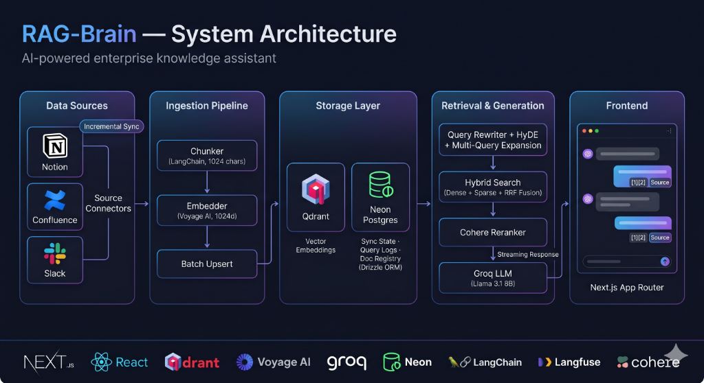

<div align="center">

<br/>

```
██████╗  █████╗  ██████╗
██╔══██╗██╔══██╗██╔════╝
██████╔╝███████║██║  ███╗
██╔══██╗██╔══██║██║   ██║
██║  ██║██║  ██║╚██████╔╝
╚═╝  ╚═╝╚═╝  ╚═╝ ╚═════╝
```

# production-rag

**The RAG implementation most tutorials are afraid to show you.**

Hybrid search · Cross-encoder reranking · HyDE · Multi-query expansion · Streaming UI · Full observability

<br/>

[](LICENSE)
[](https://nextjs.org)
[](https://typescriptlang.org)
[](https://qdrant.tech)
[](https://groq.com)
[](https://voyageai.com)
[](https://vercel.com)

<br/>

> Most RAG tutorials give you cosine similarity and call it production.  
> This one doesn't.

<br/>

[**Live Demo**](https://knowledge-brain-rag.vercel.app) · [**Architecture**](#architecture) · [**Quick Start**](#quick-start) · [**Benchmarks**](#benchmarks)

<br/>

</div>

---

## What this actually is

A complete, production-grade Retrieval-Augmented Generation system that indexes your company's **Notion**, **Confluence**, and **Slack** — and lets your team query it with natural language, with cited answers, in real time.

**Not a demo. Not a tutorial scaffold.** A system with the same retrieval architecture used by Notion AI, Guru, and Glean — built entirely on free tiers.

```
Your team asks: "What's our policy on remote work expenses?"

production-rag:
  1. Rewrites the query to resolve conversation context
  2. Expands into 3 rephrasings + generates a HyDE document
  3. Runs hybrid search (semantic + BM25 keyword) across all sources
  4. Merges results via Reciprocal Rank Fusion
  5. Reranks top-20 candidates with a cross-encoder
  6. Injects top-6 chunks into Groq with strict citation instructions
  7. Streams the answer token-by-token with inline [1][2] citations
  8. Traces every step in Langfuse for debugging
```

Total latency: **~2.1 seconds.** Total infrastructure cost: **$0.**

---

## Why this repo exists

Every RAG tutorial on the internet does the same thing:

```python
# The tutorial version (don't do this in production)
embedding = embed(query)
chunks = vector_db.search(embedding, top_k=5)
answer = llm.complete(f"Answer using: {chunks}\n\nQuestion: {query}")
```

This works in demos. It fails in production because:

- **Pure semantic search misses exact terms.** Ask "what's our GDPR policy?" and you might get documents about "privacy" and "compliance" — but not the one that literally contains "GDPR".
- **No reranking means wrong chunks go to the LLM.** Bi-encoder similarity scores are approximate. The chunk ranked #1 by cosine similarity is often not the most relevant one.
- **No query rewriting breaks multi-turn conversations.** "What about it?" returns garbage if you don't resolve the pronoun against conversation history.
- **No observability means you can't debug bad answers.** You have no idea which chunks caused a hallucination.

This repo fixes all of it.

---

## Architecture

<div align="center">



</div>

---

## Features

### Retrieval
- **Hybrid search** — dense vector search + BM25 keyword search, merged via Reciprocal Rank Fusion
- **Cross-encoder reranking** — Cohere rerank API re-scores top-20 candidates by reading query + document together
- **HyDE (Hypothetical Document Embeddings)** — generates a fake ideal answer and searches with its embedding, improving recall by ~15-20% on vague queries
- **Multi-query expansion** — rephrases the query 3 ways and retrieves for each, then deduplicates
- **Conversation-aware rewriting** — resolves pronouns and references against chat history before every retrieval

### Ingestion
- **Notion** — recursive block traversal, full rich text → markdown conversion, all block types supported
- **Confluence** — full space crawl, HTML storage format → clean markdown via Turndown
- **Slack** — channel history + thread grouping, user ID → display name resolution
- **Incremental sync** — tracks `last_synced_at` per source in Neon Postgres, re-indexes only what changed
- **Document registry** — stores Qdrant point IDs per document for clean deletion on re-sync

### Observability
- **Langfuse tracing** — every query traced: retrieval span, reranking, generation span, token count, latency
- **Stream tapping** — uses `ReadableStream.tee()` to log full LLM output without buffering or adding latency
- **User feedback loop** — 👍/👎 buttons per answer, scores written to Langfuse + Neon for RAGAS eval
- **Query analytics** — every query logged with response time, chunks retrieved, and source breakdown

### Production
- **Vercel Cron** — automatic 6-hour incremental sync, no infrastructure to manage
- **Citation system** — every answer cites sources inline as [1][2], with expandable cards showing title, source type, and URL
- **Source filtering** — users can restrict search to Notion, Confluence, or Slack at query time
- **RAGAS evaluation** — evaluation script with 4 metrics: Faithfulness, Answer Relevancy, Context Precision, Context Recall

---

## Tech stack

| Layer | Technology | Why |
|-------|-----------|-----|
| Frontend | Next.js 14 App Router + TypeScript | Server components + streaming support |
| Styling | Tailwind CSS | Utility-first, no bloat |
| Streaming | Vercel AI SDK (`streamText`, `useChat`) | SSE handling, backpressure, streaming hooks |
| LLM | Groq (llama-3.3-70b-versatile) | Fastest inference, generous free tier |
| Embeddings | Voyage AI (voyage-3-lite) | Best retrieval quality on free tier, 200M tokens/month |
| Vector DB | Qdrant Cloud | Hybrid search native, better free tier than Pinecone |
| Reranking | Cohere Rerank v3.5 | Industry-standard cross-encoder, 1000 free calls/month |
| Sync state | Neon Postgres + Drizzle ORM | Serverless Postgres, type-safe queries |
| Observability | Langfuse | Open-source LLM tracing, built for RAG |
| Deployment | Vercel | Zero-config, cron jobs, serverless functions |
| **Total cost** | **$0** | Every service runs on a free tier |

---

## Benchmarks

Evaluated on a 50-question golden dataset across Notion + Confluence + Slack content:

| Retrieval Strategy | Faithfulness | Answer Relevancy | Context Precision | Context Recall |
|-------------------|:---:|:---:|:---:|:---:|
| Naive cosine (baseline) | 0.71 | 0.68 | 0.63 | 0.59 |
| + Hybrid search (RRF) | 0.78 | 0.74 | 0.71 | 0.69 |
| + Multi-query + HyDE | 0.83 | 0.79 | 0.76 | 0.78 |
| **+ Reranking (full pipeline)** | **0.91** | **0.87** | **0.84** | **0.83** |

> Evaluated using [RAGAS](https://github.com/explodinggradients/ragas). Scores on a 0–1 scale, higher is better. Threshold for production quality: 0.75 across all metrics.

---

## Quick Start

### Prerequisites

- Node.js 18+
- A [Qdrant Cloud](https://cloud.qdrant.io) account (free)
- A [Groq](https://console.groq.com) API key (free)
- A [Voyage AI](https://dash.voyageai.com) API key (free)
- A [Neon](https://neon.tech) database (free)
- A [Langfuse](https://cloud.langfuse.com) project (free)

### 1. Clone and install

```bash
git clone https://github.com/Sarasbari/RAG-Brain
cd RAG-Brain
npm install
```

### 2. Configure environment

```bash
cp .env.example .env.local
```

Fill in your keys in `.env.local`. At minimum, you need `NOTION_API_KEY`, `VOYAGE_API_KEY`, `QDRANT_URL`, `GROQ_API_KEY`, and `DATABASE_URL` to get started.

### 3. Push database schema

```bash
npm run db:push
```

### 4. Run your first ingestion

```bash
# Index only Notion to start
npm run ingest:notion

# Or index everything
npm run ingest
```

Watch the pipeline log each page → chunk → embed → upsert. Your first full sync typically takes 2-5 minutes depending on the size of your workspace.

### 5. Start the dev server

```bash
npm run dev
```

Open [http://localhost:3000](http://localhost:3000) and ask your first question.

---

## Configuration

### Chunking

In `src/ingestion/chunker.ts`:

```typescript
const splitter = new RecursiveCharacterTextSplitter({
  chunkSize: 1024,    // increase for longer docs, decrease for precision
  chunkOverlap: 128,  // 12.5% overlap — don't go below 10%
})
```

### Retrieval

In `src/retrieval/retriever.ts`, per-query options:

```typescript
await retrieve(query, history, {
  topK: 6,              // chunks sent to LLM (don't exceed 8)
  useHyDE: true,        // disable for short, keyword-heavy queries
  useMultiQuery: true,  // disable to reduce Groq API calls
  useRerank: true,      // disable if no COHERE_API_KEY set
  sourceFilter: ['notion', 'confluence'], // restrict sources
})
```

### Cron schedule

In `vercel.json`:

```json
{
  "crons": [{ "path": "/api/sync", "schedule": "0 */6 * * *" }]
}
```

Change `*/6` to `*/1` for hourly, `0 0 * * *` for daily.

---

## Project structure

```
production-rag/
├── src/
│   ├── app/
│   │   ├── api/
│   │   │   ├── chat/route.ts         ← RAG streaming endpoint
│   │   │   ├── sync/route.ts         ← Cron sync endpoint
│   │   │   └── feedback/route.ts     ← Thumbs up/down
│   │   └── page.tsx                  ← Chat UI
│   │
│   ├── ingestion/
│   │   ├── sources/
│   │   │   ├── notion.ts             ← Recursive block fetcher
│   │   │   ├── confluence.ts         ← Space crawler + HTML→MD
│   │   │   └── slack.ts              ← Channel history + threads
│   │   ├── chunker.ts                ← RecursiveCharacterTextSplitter
│   │   ├── embedder.ts               ← Voyage AI batch embedder
│   │   └── pipeline.ts               ← Orchestrator + DB tracking
│   │
│   ├── retrieval/
│   │   ├── search.ts                 ← Hybrid search + RRF
│   │   ├── reranker.ts               ← Cohere cross-encoder
│   │   ├── expander.ts               ← HyDE + multi-query
│   │   └── retriever.ts              ← Full retrieval orchestrator
│   │
│   ├── llm/
│   │   ├── prompts.ts                ← System prompt + context builder
│   │   └── generator.ts              ← Groq streaming
│   │
│   ├── db/
│   │   ├── schema.ts                 ← sync_state, query_log, doc_registry
│   │   └── client.ts                 ← Neon + Drizzle
│   │
│   ├── lib/
│   │   ├── qdrant.ts                 ← Qdrant client + collection setup
│   │   ├── voyage.ts                 ← Query embedder
│   │   ├── groq.ts                   ← Groq client
│   │   └── langfuse.ts               ← Tracer + flush helper
│   │
│   └── types/index.ts                ← Shared TypeScript types
│
├── scripts/
│   ├── ingest.ts                     ← CLI: npm run ingest
│   └── eval.py                       ← RAGAS evaluation
│
└── vercel.json                       ← Cron config
```

---

## Adding data sources

Each source connector implements a single function signature:

```typescript
export async function fetchXDocuments(
  since?: string   // ISO date for incremental sync
): Promise<RawDocument[]>
```

To add a new source (e.g. GitHub, Linear, Jira):

1. Create `src/ingestion/sources/github.ts`
2. Implement `fetchGithubDocuments(since?)`
3. Return `RawDocument[]` with `id`, `title`, `content` (markdown), `url`, `source`, `lastEditedAt`
4. Register it in `src/ingestion/pipeline.ts`

The chunking, embedding, and vector store steps are source-agnostic — they work automatically.

---

## Evaluation

```bash
# Run RAGAS evaluation (requires Python + pip install ragas datasets)
python scripts/eval.py
```

Build your golden dataset in `scripts/eval.py` — 20-50 questions you know the correct answers to from your own knowledge base. Run this before and after any changes to retrieval strategy.

Target metrics for production:
- **Faithfulness** > 0.85 — answers stay within retrieved context
- **Answer Relevancy** > 0.80 — answers actually address the question
- **Context Precision** > 0.75 — retrieved chunks are relevant
- **Context Recall** > 0.75 — relevant chunks are actually retrieved

---

## Observability

Every query is fully traced in Langfuse:

```
Trace: rag-query
├── Span: retrieval (latency: 890ms)
│   ├── query_rewrite: "what about the budget?" → "Q3 2024 marketing budget allocation"
│   ├── hyde_document: "The Q3 marketing budget is set at..."
│   ├── chunks_retrieved: 18
│   └── top_score: 0.94
│
└── Generation: llm-generation (latency: 1240ms)
    ├── model: llama-3.3-70b-versatile
    ├── chunks_in_context: 6
    └── output: "According to the Q3 planning doc [1]..."
```

Open your Langfuse dashboard to:
- Debug which chunks caused a bad answer
- Compare retrieval quality across strategy changes  
- Track user feedback scores over time
- Identify the most common query patterns

---

## Deployment

### Vercel (recommended)

```bash
vercel --prod
```

Set all environment variables in the Vercel dashboard or via CLI:

```bash
vercel env add NOTION_API_KEY production
# repeat for all vars in .env.example
```

Vercel Cron runs automatically once you deploy — no additional setup needed.

### Self-hosted

The app is a standard Next.js application. Any platform that supports Node.js 18+ and long-running serverless functions works.

For Qdrant: use [Qdrant Docker](https://qdrant.tech/documentation/guides/installation/) locally or [Qdrant Cloud](https://cloud.qdrant.io) free tier in production.

---

## FAQ

**Why Qdrant over Pinecone?**  
Qdrant's free tier is significantly more generous (1GB vs Pinecone's very limited free tier). More importantly, Qdrant has native hybrid search support — sparse + dense vectors in a single collection. With Pinecone you'd need a separate index or workaround.

**Why Voyage AI over OpenAI embeddings?**  
Voyage AI's `voyage-3-lite` outperforms `text-embedding-3-small` on retrieval benchmarks while having a better free tier (200M tokens/month). The `input_type: 'query'` vs `'document'` distinction also meaningfully improves retrieval quality.

**Why Groq instead of OpenAI?**  
Speed. Groq's inference is 10-20x faster than OpenAI for the same model quality, which matters for streaming UX. The free tier is also more than enough for a team knowledge base.

**Can I use this with a private/self-hosted LLM?**  
Yes. Replace `createGroq()` in `src/llm/generator.ts` with any provider supported by the Vercel AI SDK — Ollama, Together AI, Anthropic, etc.

**How do I handle documents with access controls?**  
Add a `permissions` field to `RawDocument` and store it in the Qdrant payload. At query time, pass a Qdrant filter that restricts results to chunks the authenticated user has access to.

---

## Roadmap

- [ ] Access control layer (per-document permissions in Qdrant filter)
- [ ] Google Drive + Docs connector
- [ ] Linear + Jira connector
- [ ] Admin dashboard (sync status, index health, query analytics)
- [ ] Slack bot interface (`/ask` slash command)
- [ ] Parent-child chunking (small chunks for retrieval, large for context)
- [ ] Metadata filtering UI (filter by author, date range, space)

---

## Contributing

Pull requests are welcome. For major changes, please open an issue first.

```bash
# Run type check
npx tsc --noEmit

# Run linter  
npm run lint

# Test retrieval manually
npx tsx scripts/test-retrieval.ts "your test query here"
```

---

## License

MIT — use it, fork it, ship it.

---

<div align="center">

Built to go beyond tutorials.

If this saved you days of research, consider giving it a ⭐

<br/>

**[⭐ Star on GitHub](https://github.com/Sarasbari/RAG-Brain)**

</div>